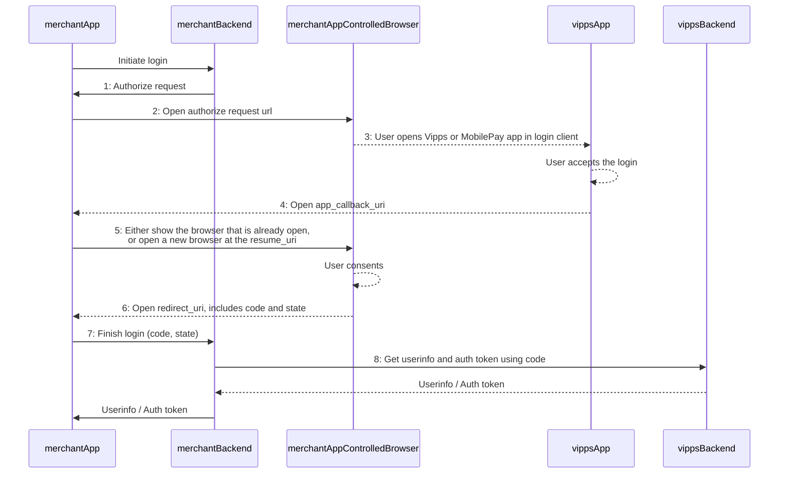

<!-- START_METADATA
---
title: App integration
sidebar_label: Integrate from a mobile app
sidebar_position: 31
description: Integrate from a mobile app.
pagination_next: null
pagination_prev: null
---
END_METADATA -->

# Integrate from a mobile app

App integrations are currently based on using browsers.

You can enable automatic switch of users back to the merchant app, from the Vipps or MobilePay app.

This flow is designed to be used with apps.
It requires that the app initiate Vipps Login in an external browser that is opened within the app,
as described in
[Using Vipps Login in native applications](important-information.md#using-vipps-login-in-native-applications).

You should not use web views.

The merchant must specify the app URI, where the user will be returned after completing the confirmation in the Vipps or MobilePay app.

Expected flow:

```text
Merchant app -> Merchant app controlled browser -> Vipps or MobilePay app -> Merchant app controlled browser -> Merchant app
```

This flow can be enabled per login request by adding the `requested_flow=app_to_app`
and `app_callback_uri` parameters to the [Authorize](browser-flow-integration.md#oauth-20-authorize) request.

This flow requires both the `app_callback_uri` and `redirect_uri` parameters.

The `app_callback_uri` should be a URI that makes the device switch back to the merchant's
app again after the Vipps or MobilePay app portion of the flow is done (example: "merchant-app://callback").

The `redirect_uri` is opened in the browser once the Vipps login flow is completed there.
This URL can either redirect the user to a page in the browser, or be handled/intercepted by the merchant app.
In either case it is important to avoid using static client secrets in the app for completing the login.
(For more information see <https://github.com/openid/AppAuth-Android#utilizing-client-secrets-dangerous> and <https://tools.ietf.org/html/rfc8252#section-8.5>).

*Both* URIs must be added in the [portal.vipps.no](https://portal.vipps.no/),
you find more information on how to do this [Developer resources: Portal: How to set up login on your sales unit?](https://developer.vippsmobilepay.com/docs/developer-resources/portal#how-to-setup-login-on-your-sales-unit).

**Please note:** URIs specified on [portal.vipps.no](https://portal.vipps.no/)
must be *exactly* the same as used in the API calls. Be extra careful with
trailing `/` and URL-encoded entities. If the URIs are not identical you will get
this error:

```text
The provided authorization grant (e.g., authorization code, resource owner credentials) or refresh token is invalid, expired, revoked, does not match the redirection URI used in the authorization request, or was issued to another client
```

The Vipps or MobilePay app will return some data with the return to the `app_callback_uri`.
It contains two query parameters `state` and `resume_uri`.
`State` is the OIDC `state` parameter passed at the start of a login which can be used to identify the specific login if needed.

The `resume_uri` parameter that we generate
can optionally be used to resume the login when the user returns from the Vipps or MobilePay app.
If the merchant app manages to keep the initial browser window open it is not required to use the `resume_uri`.
To use the `resume_uri`, it must be opened in the same browser used in the initial phase
(such as `ASWebAuthenticationSession` or *Chrome Custom Tabs*). It is required that the browser contains the cookies
from the interaction that happens before the user is sent to the Vipps or MobilePay app.

Example `app_callback_uri` request

```http
merchant-app://callback/?state=RFiQdrl_lvJUpVmTRSKmsZRGLM0G1N1qh0WebZ1gDNk&resume_uri=https%3A%2F%2Fapi.vipps.no%2Fvipps-login-idp%2Findex.html%3FtabId%3D7607f7f0-7ae2-49b7-9cb5-102143dac4ea
```

## A typical flow/implementation might look like this



The dotted lines in this diagram are handled by us (or the user),
while the filled lines need to be implemented by the merchant.

1. Merchant backend generates an [OpenID authentication flow authorization URI](core-concepts.md#oauth-20-authorize).
   The URI is communicated to the merchant app.
2. Merchant app uses the URI to initiate Vipps Login in an external browser that is opened within the app,
   see the [specification](important-information.md##using-vipps-login-in-native-applications) for details.
3. Vipps Login will open the Vipps or MobilePay app, if required.
   (If the user is remembered in the browser, they will be authenticated directly,
   and they will then be on step 6 below).
4. Vipps or MobilePay app opens the deep link `app_callback_uri` parameter after the user has approved the login.
5. Merchant app handles the link in one of two ways:
    * Display the same browser instance that was created in 1.
    * Open a browser again using the `resume_uri`-query parameter that is returned with the request to the `app_callback_uri`.
6. Vipps Login finalizes the authentication of the user and obtains consent to share information if needed.
   When this is finished the user will be redirected to the `redirect_uri`.
   The Vipps Login process has now finished, and the merchant controls the remaining process.
7. Merchant app sends the `code` and `state`parameters received in the callback to the merchant backend.
8. Merchant backend fetches the access tokens and user information.

Example authorize request URL:

```http
.../oauth2/auth?app_callback_uri=https://example.com/app-callback&requested_flow=app_to_app&scope=<scopes>&response_type=code&redirect_uri=merchantapp://callback&code_challenge_method=S256&state=<state>&nonce=<nonce>&client_id=<clientid>&code_challenge=<challenge>
```

Parameters `state` and possibly `error` will be passed as query parameters to the `app_callback_uri`. The `state` parameter has the same value as the `state` parameter passed to the [Authorize](core-concepts.md#oauth-20-authorize) request.

Example success callback from app (step 4):

```http
https://example.com/app-callback?state=218gz18yveu1ybajwh2g1h3g&resume_uri=https://.../vipps-login-idp/index.html?tabid=fjeiwfje43t
merchantapp://app-callback?state=218gz18yveu1ybajwh2g1h3g&resume_uri=https://.../vipps-login-idp/index.html?tabid=fjeiwfje43t
```

Example error callback from app (step 4):

```http
https://example.com/app-callback?state=218gz18yveu1ybajwh2g1h3g?error=unknown_error
merchantapp://app-callback?state=218gz18yveu1ybajwh2g1h3g?error=unknown_error
```

Example success callback from browser (step 6):

```http
https://example.com/redirect-uri?state=218gz18yveu1ybajwh2g1h3g&code=<code>&scope=openid
merchantapp://redirect-uri?state=218gz18yveu1ybajwh2g1h3g&code=<code>&scope=openid
```
