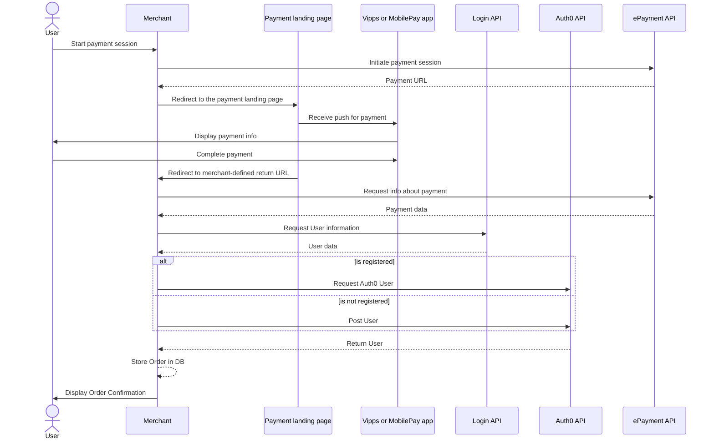
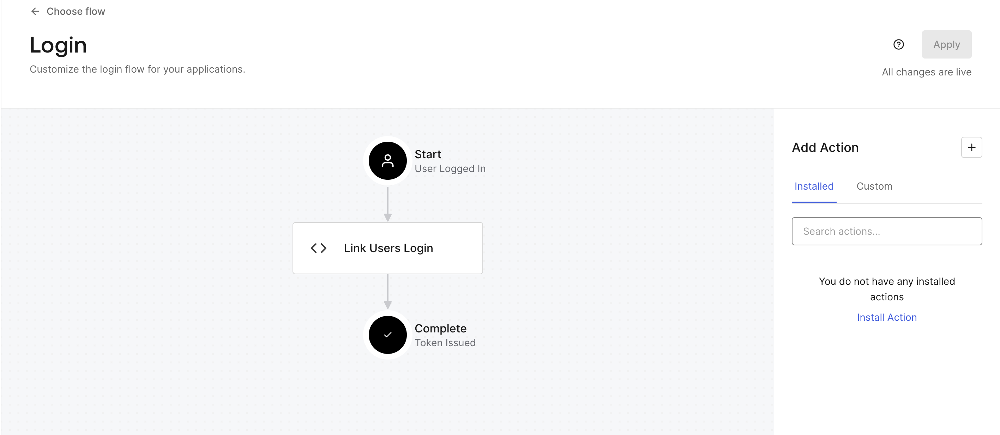

<!-- START_METADATA
---
title: Payment flow using Auth0
sidebar_label: Payment flow
sidebar_position: 192
pagination_next: null
pagination_prev: null
---
END_METADATA -->

# Payment flow using Auth0

The first part of this guide will describe how to implement a simple payment flow where a user can pay for an order and give consent to sharing user info without the need of being signed in. The second part will show how the payment can be used to get information to store a user in Auth0. The third part will describe how to link the created user to a Vipps or MobilePay account using [Auth0's Login Flow](https://auth0.com/docs/customize/actions/flows-and-triggers/login-flow).

The code snippets are using the [.NET SDK](https://developer.vippsmobilepay.com/docs/SDKs/dotnet-sdk/) to communicate with the API platform. By following these steps, a user can pay for an order and later use Login to get an overview of his/her orders.

## Prerequisites

* [Create an Auth0 tenant](https://auth0.com/docs/get-started/auth0-overview/create-tenants).
* Create a test unit in the [Merchant portal](https://developer.vippsmobilepay.com/docs/developer-resources/portal/).
  * Save the `client_id` and `client_secret` for use in later steps.
* Add the SDK configuration to Program.cs.

  ```c#
  var vippsConfigurationOptions = new VippsConfigurationOptions
  {
      ClientId = "CLIENT-ID",
      ClientSecret = "CLIENT-SECRET",
      MerchantSerialNumber = "MERCHANT-SERIAL-NUMBER",
      SubscriptionKey = "SUBSCRIPTION-KEY",
      UseTestMode = true
  };
  ```

  Note: The above example is for illustrating what parameters should be set in the `VippsConfigurationOptions`. Make sure to store your client credentials safely!

  If you are developing in the production environment, do not include `UseTestMode`.

  For further explanation, refer to the [SDKs](https://developer.vippsmobilepay.com/docs/SDKs/) section.

* Configure the [Auth0 Management API](#configure-auth0-management-api).
* Implement a [Vipps Social Connection](./SocialConnectionLogin.md).

## Configure Auth0 Management API

To be able to use the Auth0 Management API, some configuration is needed in your Auth0 tenant. The Management API is designed for server-side usage, as it requires storing the secrets in a secure location. It will later be used to store users in Auth0.

On the Auth0 dashboard, go to *Applications* > *APIs* and click on *Auth0 Management API*. Select the *Test* tab and click *Create a test application*. You should now have a new application named Auth0 Management API (Test Application) located under *Applications*.

Select the newly generated *Auth0 Management API (Test Application)*. Under *APIs*, expand *Auth0 Management API*. Make sure that the API is authorized and that all permissions are granted. Under *settings*, make sure to save the following for use in later steps:

* Domain
* Client ID
* Client Secret

## Sequence Diagram

The Auth0 payment flow consists of:

1. Initiating a payment session
2. Storing a user in Auth0
3. Linking an Auth0 user to Vipps MobilePay



## Initiate payment session with profile sharing

To initiate a payment, the merchant backend uses the [ePayment API](https://developer.vippsmobilepay.com/docs/APIs/epayment-api/) to create a payment endpoint. The endpoint will return a redirect URL. The redirect URL is where the user is sent to confirm the payment. The Return URL is the URL that the user will be sent to after a successful payment. This can for example be an order confirmation page/endpoint.

The parameters needed to create a payment are:

* Phone Number: The phone number of the user
* Amount: The payment amount
* Payment Description: Description of what the user is paying for
* Reference: An unique identifier for an order

`Scope` defines the information you are requesting from the user. Additional [scopes](../../core-concepts.md#scopes) can be added by adding them to the *Scope* string in the *ProfileRequest*.

```c#
public async Task<string> CreatePayment(string phoneNumber, long amount, string paymentDescription, string reference)
    {
        var request = new CreatePaymentRequest
        {
            Amount = new Amount
            {
                Value = amount,
                Currency = Currency.NOK
            },
            PaymentMethod = new PaymentMethod
            {
                Type = PaymentMethodType.WALLET
            },
            Customer = new Customer
            {
                PhoneNumber = phoneNumber
            },
            Reference = reference ,
            UserFlow = CreatePaymentRequestUserFlow.WEB_REDIRECT,
            ReturnUrl = "<ReturnURL>",
            PaymentDescription = paymentDescription,
            Profile = new ProfileRequest
            {
                Scope = "name phoneNumber address birthDate"
            }
        };
        var result = await EpaymentService.CreatePayment(request);
        return result.RedirectUrl.ToString();
    }
```

See the [ePayment API spec](https://developer.vippsmobilepay.com/api/epayment/#tag/CreatePayments) for more details.

## Store user in Auth0

If the user confirms the payment and gives consent to user information, he/she will be redirected to the `ReturnURL`. The merchant is now able to collect user information and store it in Auth0. In this part, the merchant must do the following:

1. Get the payment by the reference, and collect the user's sub
2. Use the sub to collect user information
3. Store the user information in Auth0

### Get sub from Payment

```c#
public async Task<string> GetSubFromVippsPayment(string reference)
{
    var request = await EpaymentService.GetPayment(reference);
    return request.Profile.Sub;
}
```

The `sub` is an identifier that will be unique to a given user. For more information, see [FAQ: What is the sub?](../../../vipps-login-api-faq.md#what-is-the-sub)

### Use the sub to collect user information

To get user information, you will have to use the Login API which is not supported by the SDK. Here, you must configure an HttpClient where you must add a Bearer token in the authorization header. You can get the access token by following the [Access token API guide](https://developer.vippsmobilepay.com/docs/APIs/access-token-api/#get-an-access-token) or use the SDK like this:

```c#
public async Task<User?> GetUserInfo(string sub)
    {
        var accessToken = await AccessTokenService.GetAccessToken();
        HttpClient client = CreateHttpClient(); // Safely create http client
        client.DefaultRequestHeaders.Add("Authorization", $"Bearer {accessToken}");
        var response = await client.GetAsync($"<base_url>/vipps-userinfo-api/userinfo/{sub}");

        if (!response.IsSuccessStatusCode)
        {
            return null;
        }

        var body = await response.Content.ReadAsStringAsync();
        User? user = JsonConvert.DeserializeObject<User>(body);
        return user;
    }
```

Once the user info has been received, we can create and store the user in Auth0. This can be done through the [Auth0 Management API](https://auth0.com/docs/api/management/v2). We will have to store the user as a Database Connection. This is because Auth0 does not allow creating users from Social Connections through the API. These users can later be linked when the user performs a Vipps or MobilePay login.

## Add user to Auth0

To create a user we must:

* [Acquire an access token](#acquire-an-auth0-access-token)
* [Create a Management API Client](#create-a-management-api-client)
* [Check if a user exists](#check-if-a-user-exists)
* [Create and store a user](#create-and-store-a-user)

### Acquire an Auth0 access token

To acquire an Auth0 access token, we will have to make create an HTTP request. The specifics for the request can be found under *Applications* > *APIs* > *Auth0 Management API*> *Test*. An example of how to implement this in .NET is shown below

```c#
    private async Task<string?> GetAuth0Token()
    {
        HttpClient client = CreateHttpClient(); // Safely create http client
        var payload = new
        {
            client_id = "<AUTH0_CLIENT_ID>",
            client_secret = "<AUTH0_CLIENT_SECRET>",
            audience = "https://<AUTH_0_DOMAIN>/api/v2/",
            grant_type = "client_credentials"
        };

        var content = new StringContent(JsonConvert.SerializeObject(payload), Encoding.UTF8, "application/json");
        var response = await httpClient.PostAsync("https://<AUTH_0_DOMAIN>/oauth/token", content);

        if (!response.IsSuccessStatusCode)
        {
            return "";
        }

        var responseContent = response.Content.ReadAsStringAsync().Result;
        TokenResponse tokenResponse = JsonConvert.DeserializeObject<TokenResponse>(responseContent);
        return tokenResponse.AccessToken;
    }
```

where `TokenResponse` is defined as

```c#
    struct TokenResponse
    {
        [JsonProperty("access_token")]
        public string AccessToken;
    }
```

Make sure to replace `AUTH0_CLIENT_ID`, `AUTH0_CLIENT_SECRET`, and `AUTH_0_DOMAIN` with the values recorded when configuring the [Auth0 Management API](#configure-auth0-management-api).

### Create a Management API Client

To create and store a user, you can use a Management API Client provided by the [Auth0 Management SDK](https://www.nuget.org/packages/Auth0.ManagementApi). The parameters required are the Auth0 access token and the previously recorded Auth0 Domain.

```c#
var managementApiClient = new ManagementApiClient(accessToken, "<AUTH_0_DOMAIN>");
```

### Check if a user exists

Before a user can be created through the API, you must make sure that there are no users already stored with the same user ID. Each user stored in Auth0 will have a unique user ID. It will typically be concatenated of a provider, connection, and a unique string. For [login in Auth0 using Social Connections](./SocialConnectionLogin.md), it will be in this form:

```json
"oauth2|VippsLogin|{sub}"
```

Here, the `sub` is a unique identifier. See [FAQ: What is the sub](../../../vipps-login-api-faq.md#what-is-the-sub) for details.

In this case, the provider is `oauth2` and the connection is `VippsLogin`.

To check if a user exists given a user ID, you can use the `Users.GetAsync()` method from the Management API Client. This will get the requested user if it exists, otherwise, it will throw an exception. In the examples below we return `true` or `false` depending on the outcome, but you can choose to handle exceptions differently based on the needs of your applications.

```c#
private async Task<bool> UserExist(ManagementApiClient managementApiClient, string userId)
{
    try
    {
        var userGet = await managementApiClient.Users.GetAsync(userId);
        return true;
    }
    catch (Exception e)
    {
        // If a user with the userId doesn't exist, the managementApiClient will throw an exception
        return false;
    }
}
```

### Create and store a user

To create an Auth0 user, you can use the `Users.CreateAsync()` method. This needs a `UserCreateRequest` as a parameter.

```c#
private async Task<bool> PostUser(ManagementApiClient managementApiClient, string sub, User user)
{
    try
    {
        var userCreate = new UserCreateRequest
        {
            Email = user.Email,
            VerifyEmail = false,
            Password = Guid.NewGuid().ToString(),
            Connection = "Username-Password-Authentication",
            FullName = user.Name,
            UserId = sub
        };

        var createdUser = await managementApiClient.Users.CreateAsync(userCreate);
        return true;
    }
    catch (Exception e)
    {
        // If a user cannot be created, the managementApiClient will throw an exception
        return false;
    }

}
```

When creating the `UserCreateRequest`, it is important to specify the following parameters:

* `Email` - email of the user provided by the Userinfo endpoint.
* `VerifyEmail`- must be set to `false` to prevent Auth0 from requesting email verification.
* `Password` - will not be used by the user and should be set to an unknown GUID.
* `FullName` - the name of the user provided by the Userinfo endpoint.
* `UserId` - must be set to `sub` provided by the Userinfo endpoint to make sure the Auth0 users will be linked correctly.

A complete implementation of checking if a user exists and creating it if not can look like this:

```c#
public async Task<bool> CreateAuth0User(User user, string sub)
{
    var token = await GetAuth0Token();

    var managementApiClient = new ManagementApiClient(token, "<AUTH0_DOMAIN>");

    if (await UserExist(managementApiClient, $"oauth2|VippsLogin|{sub}") || await UserExist(managementApiClient, $"auth0|{sub}"))
    {
        return true;
    }

    if (await PostUser(managementApiClient, sub, user))
    {
        return true;
    }
    return false;
}
```

In this example, we check if either an Auth0 user has already been created as a result of a payment, or if it has been created as a result of using a [Login Social Connection](./SocialConnectionLogin.md).

## Link User

If a user first goes through the payment flow and later wants to log in with Vipps or MobilePay, you should link the users to each other. After the linking of the users has been done, only one user will appear in Auth0, but with two identities. This can be done using [Actions in Auth0](https://auth0.com/docs/customize/actions). You can go to *Actions* > *Library* and click on *Build Custom*. Then you can create a name and set the trigger to be *Login / Post Login*. Press *Create* and fill in the code below.

```js
exports.onExecutePostLogin = async (event, api) => {
  if (event.connection.name != "<Your Social Connection name>") {
    return;
  }

  const ManagementClient = require("auth0").ManagementClient;

  const DOMAIN = event.secrets.domain;
  const CLIENT_ID = event.secrets.client_id;
  const CLIENT_SECRET = event.secrets.client_secret;

  const management = new ManagementClient({
    domain: DOMAIN,
    clientId: CLIENT_ID,
    clientSecret: CLIENT_SECRET,
  });

  const sub = event.user.user_id.split("|")[2];
  try {
    const user = await management.users.get({ id: `auth0|${sub}` });
    await management.linkUsers(event.user.user_id, {
      user_id: user.user_id,
      provider: "auth0",
    });
  } catch (e) {
    console.log(e);
    return;
  }
};
```

The linking is only necessary because we are using a *Vipps Social Connection*.
Fill out your *Vipps Social Connection Name*. Under the *Secrets* section, you should create the secrets:

1. client_id
2. domain
3. client_secret

Where the values should be set to the values recorded in the [Configure Auth0 Management API](#configure-auth0-management-api) step.

Make sure to add the Action to the login flow under *Actions* > *Flows* > *Login*.


After linking, the *Raw JSON* of the new user in Auth0 will now look like this:

```json
{
  "created_at": "2023-07-04T08:16:58.209Z",
  "email": "ola.nordmann@vipps.no",
  "identities": [
    {
      "provider": "oauth2",
      "user_id": "VippsLogin|{sub}",
      "connection": "VippsLogin",
      "isSocial": true
    },
    {
      "profileData": {
        "email": "ola.nordmann@vipps.no",
        "name": "Ola Nordmann",
        "email_verified": false
      },
      "connection": "Username-Password-Authentication",
      "user_id": "{sub}",
      "provider": "auth0",
      "isSocial": false
    }
  ],
  "name": "Ola Nordmann",
  "nickname": "ola.nordmann",
  "phone_number": "+4712345678",
  "picture": "https://s.gravatar.com/avatar/{...}.png",
  "updated_at": "2023-07-04T10:57:43.939Z",
  "user_id": "oauth2|VippsLogin|{sub}",
  "last_ip": "77.40.174.194",
  "last_login": "2023-07-04T10:57:43.939Z",
  "logins_count": 2,
  "blocked_for": [],
  "guardian_authenticators": []
}
```

## References

Implementing a payment flow

* [SDK](https://developer.vippsmobilepay.com/docs/SDKs/)
* [ePayment API](https://developer.vippsmobilepay.com/docs/APIs/epayment-api/)

Create and store users in Auth0

* [Auth0 Management API](https://auth0.com/docs/api/management/v2)

Linking users in Auth0

* [Create custom actions in Ath0](https://auth0.com/docs/customize/actions)

Terminology

* [Common terms](https://developer.vippsmobilepay.com/docs/terminology/#common-terms)
