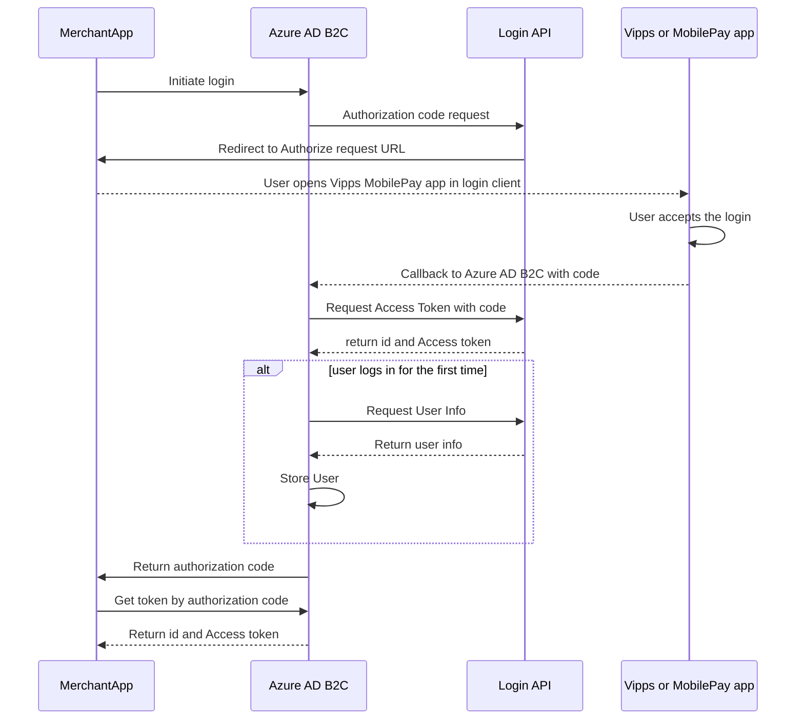

<!-- START_METADATA
---
title: Login API in Azure AD B2C using custom policies
sidebar_label: Login with custom policy
sidebar_position: 201
pagination_next: null
pagination_prev: null
---
END_METADATA -->

# Login API in Azure AD B2C using custom policies

This guide will describe how to use Azure AD B2C's custom policies to automatically create and log users in using Vipps MobilePay.
The custom policy implementation will provide the
[user initiated login from a website](../../../how-it-works/user-initiated-login-howitworks.md#the-login-process).

With Azure AD B2C's custom policies, merchants can implement a Vipps login flow by using Vipps as an identity provider. Other identity providers can be configured to correspond to the same user in Azure AD B2C as Vipps MobilePay. For more details on creating custom policies with identity providers in Azure AD B2C, see [References](#references).

Note: Azure AD B2C provides preconfigured user flows that can be used to authenticate, create, and log in users. This will however not provide any user information like name, email, etc. To achieve this, a custom policy must be provided.

## Prerequisites

- [Create an Azure AD B2C tenant](https://learn.microsoft.com/en-us/azure/active-directory-b2c/tutorial-create-tenant).
- [Register a web application](https://learn.microsoft.com/en-us/azure/active-directory-b2c/tutorial-register-applications?tabs=app-reg-ga). For testing in the Azure portal it is necessary to enable ID token implicit grant.
- Create a test unit in the [Merchant portal](https://developer.vippsmobilepay.com/docs/developer-resources/portal/).

  - Save the `client_id` and `client_secret` for use in later steps.
  - Set the Token endpoint authentication method to `client_secret_post`.
  - Add the following redirect URI to the list of callback URIs, and replace `yourtenantname` with the name of your tenant.

  ```bash
  https://yourtenantname.b2clogin.com/yourtenantname.onmicrosoft.com/oauth2/authresp
  ```

## Custom policy template

To implement Vipps login as a custom policy, you must download the modified version of the Azure AD B2C Custom Policy starter pack. The provided files consist of the essential elements for registration and login using Vipps as an identity provider.

Download the following files:

- [**TrustFrameworkBase.xml**](https://github.com/vippsas/vipps-developer-docs/tree/main/static/downloads/azure-b2c/TrustFrameworkBase.xml) - Few modifications are required.

- [**TrustFrameworkLocalization.xml**](https://github.com/vippsas/vipps-developer-docs/tree/main/static/downloads/azure-b2c/TrustFrameworkLocalization.xml) - Few modifications are required.

- [**TrustFrameworkExtensions.xml**](https://github.com/vippsas/vipps-developer-docs/tree/main/static/downloads/azure-b2c/TrustFrameworkExtensions.xml) - Modifications are required.

- [**SignUpOrSignin.xml**](https://github.com/vippsas/vipps-developer-docs/tree/main/static/downloads/azure-b2c/SignUpOrSignin.xml) - Few modifications are required.

To make the custom policy work with your Azure AD B2C tenant, all files must have all instances of `yourtenantid` replaced by the name of your tenant. For example: `yourtenantname.onmicrosoft.com`.

## Client ID and secret

To configure the client ID, locate the `<TechnicalProfile Id="Vipps-OpenIdConnect">` in the `TrustFrameworkExtentions` file. Under `<Metadata>`, locate the `<Item Key="client_id">` field and enter the client ID of your test unit.

Also, enter your Merchant Serial number in the field `<Item Key="Merchant-Serial-Number">`.

## Create a policy key

To create a policy key, follow the steps in the *Create a policy key* section in the [Generic OpenID Connect](https://learn.microsoft.com/en-us/azure/active-directory-b2c/identity-provider-generic-openid-connect?pivots=b2c-custom-policy) documentation. Under `<CryptographicKeys>`, enter the name of your policy key.

For example:
`<Key Id="client_secret" StorageReferenceId="B2C_1A_VippsSecret"/>`

## Scope

Scope defines the information you are requesting from the users. The `openid` scope must be specified, but the Vipps custom policy template also supports `name`, `email`, and `phoneNumber`. These attributes will be used to create a user in Azure AD B2C.

Additional [scopes](../../core-concepts.md#scopes) can be added, by adding them to *TrustFrameworkExtensions.xml* and *SignUpOrSignin.xml*.

## Vipps environment

You must change the comments `<!-- Vipps environment -->` in *TrustFrameworkExtensions.xml* to the environment you are using. This could be either `api.vipps.no` (Prod) or `apitest.vipps.no` (Test).

## Upload the policy

1. Select the *Identity Experience Framework* menu in your B2C tenant in the Azure portal.
2. Select *Upload custom policy*.
3. In this order, upload the policy files:

   a. *TrustFrameworkBase.xml*

   b. *TrustFrameworkLocalization.xml*

   c. *TrustFrameworkExtensions.xml*

   d. *SignUpOrSignin.xml*

To test the policy, select *B2C_1A_signup_signin*, select the web application you wish to test,
specify a Reply URL (for example, [https://jwt.ms](https://jwt.ms)), and click *Run Now*.
The Reply URL will be the page the user is sent to after a successful login.

## Sequence Diagram of the flow implementation



## References

Creating a custom policy:

- [Azure AD B2C custom policy overview](https://learn.microsoft.com/en-us/azure/active-directory-b2c/custom-policy-overview)
- [Create user flows and custom policies in Azure Active Directory B2C](https://learn.microsoft.com/en-us/azure/active-directory-b2c/tutorial-create-user-flows?pivots=b2c-custom-policy)
- [Set up sign-up and sign-in with generic OpenID Connect using Azure Active Directory B2C](https://learn.microsoft.com/en-us/azure/active-directory-b2c/identity-provider-generic-openid-connect?pivots=b2c-custom-policy)

Calling a REST API using a custom policy:

- [Define a RESTful technical profile in an Azure Active Directory B2C custom policy](https://learn.microsoft.com/en-us/azure/active-directory-b2c/restful-technical-profile)
- [Call a REST API by using Azure Active Directory B2C custom policy](https://learn.microsoft.com/en-us/azure/active-directory-b2c/custom-policies-series-call-rest-api)

Terminology:

- [Common terms](https://developer.vippsmobilepay.com/docs/knowledge-base/terminology/#common-terms)
