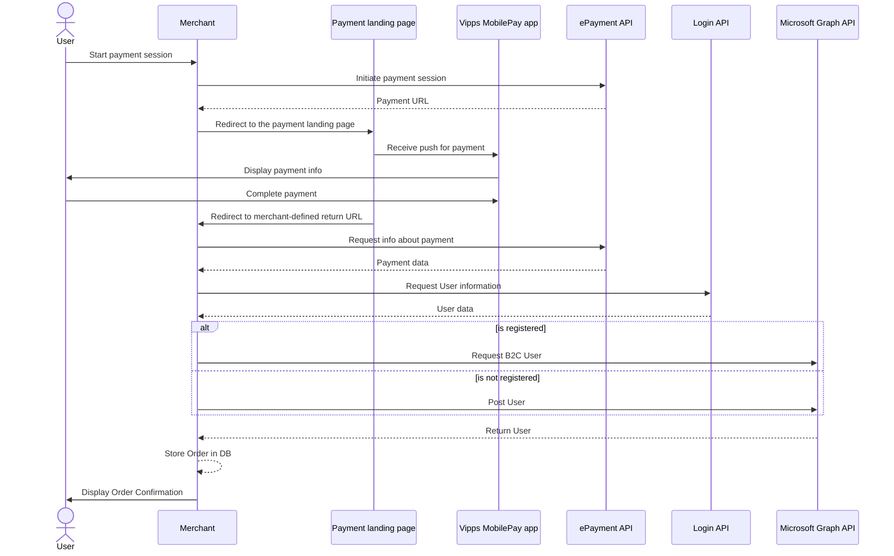

<!-- START_METADATA
---
title: Payment flow using Azure AD B2C
sidebar_label: Payment flow
sidebar_position: 202
pagination_next: null
pagination_prev: null
---
END_METADATA -->

# Payment flow using Azure AD B2C

The first part of this guide will describe how to implement a simple payment flow where a user can pay for an order and give consent to sharing user info without the need of being signed in. The second part will show how the payment can be used to get information to store a user in Azure AD B2C.

The code snippets are using the [.NET SDK](https://developer.vippsmobilepay.com/docs/SDKs/dotnet-sdk/) to communicate with the API platform. By following these steps, a user can pay for an order and later use Vipps Login to get an overview of his/her orders.

## Prerequisites

- [Create an Azure AD B2C tenant](https://learn.microsoft.com/en-us/azure/active-directory-b2c/tutorial-create-tenant).
- [Register a web application](https://learn.microsoft.com/en-us/azure/active-directory-b2c/tutorial-register-applications?tabs=app-reg-ga) to use the [Microsoft Graph API](https://learn.microsoft.com/en-us/azure/active-directory-b2c/microsoft-graph-operations)
- Create a test unit in the [Merchant portal](https://developer.vippsmobilepay.com/docs/developer-resources/portal/).
  - Save the `client_id` and `client_secret` for use in later steps.
- Add the Vipps configuration to Program.cs.

  ```c#
  var vippsConfigurationOptions = new VippsConfigurationOptions
  {
      ClientId = "CLIENT-ID",
      ClientSecret = "CLIENT-SECRET",
      MerchantSerialNumber = "MERCHANT-SERIAL-NUMBER",
      SubscriptionKey = "SUBSCRIPTION-KEY",
      UseTestMode = true
  };
  ```

  Note: The above example is for illustrating what parameters should be set in the `VippsConfigurationOptions`. Make sure to store your client credentials safely!

  If you are developing in the production environment, do not include `UseTestMode`.

  For further explanation, refer to the [SDKs](https://developer.vippsmobilepay.com/docs/SDKs/) section.

## Sequence Diagram

The Azure AD B2C payment flow consists of:

1. Initiating a payment session
2. Storing user in Azure AD B2C



## Initiate payment session with profile sharing

To initiate a payment, the merchant backend requires the [ePayment API](https://developer.vippsmobilepay.com/docs/APIs/epayment-api/) to create a payment endpoint. The endpoint will return a redirect URL. The redirect URL is where the user is sent to confirm the payment. The Return URL is the URL that the user will be sent to after a successful payment. For example, an order confirmation page/endpoint.

The parameters needed to create a payment are:

- Phone Number: The phone number of the user
- Amount: The payment amount
- Payment Description: Description of what the user is paying for
- Reference: An unique identifier for an order

Scope defines the information you are requesting from the user. Additional [scopes](../../core-concepts.md#scopes) can be added by adding them to the _Scope_ string in the _ProfileRequest_.

```c#
public async Task<string> CreatePayment(string phoneNumber, long amount, string paymentDescription, string reference)
{
    var request = new CreatePaymentRequest
    {
        Amount = new Amount
        {
            Value = amount,
            Currency = Currency.NOK
        },
        PaymentMethod = new PaymentMethod
        {
            Type = PaymentMethodType.WALLET
        },
        Customer = new Customer
        {
            PhoneNumber = phoneNumber
        },
        Reference = reference ,
        UserFlow = CreatePaymentRequestUserFlow.WEB_REDIRECT,
        ReturnUrl = "<ReturnURL>",
        PaymentDescription = paymentDescription,
        Profile = new ProfileRequest
        {
            Scope = "name phoneNumber birthDate"
        }
    };
    var result = await EpaymentService.CreatePayment(request);
    return result.RedirectUrl.ToString();
}
```

See the [ePayment API spec](https://developer.vippsmobilepay.com/api/epayment/#tag/CreatePayments) for more details.

## Store user in Azure AD B2C

If the user confirms the payment and gives consent to user information, he/she will be redirected to the `ReturnURL`. The merchant is now able to collect user information and store it in Azure AD B2C. In this part, the merchant must do the following:

1. Get the payment by the reference, and collect the user's sub
2. Use the sub to collect user information
3. Store the user information in Azure AD B2C

### Get sub from Vipps Payment

```c#
public async Task<string> GetSubFromVippsPayment(string reference)
{
    var request = await EpaymentService.GetPayment(reference);
    return request.Profile.Sub;
}
```

The `sub` is a unique identifier for a given user. For more information, see [FAQ: What is the sub?](../../../vipps-login-api-faq.md#what-is-the-sub)

### Use the sub to collect user information

To get user information, you will have to use the Login API which is not supported by the SDK. Here, you must configure an HttpClient where you must add a Bearer token in the authorization header. You can get the access token by following the [Access token API guide](https://developer.vippsmobilepay.com/docs/APIs/access-token-api/#get-an-access-token) or use the SDK like this:

```c#
public async Task<User?> GetUserInfo(string sub)
{
    var accessToken = await AccessTokenService.GetAccessToken();
    HttpClient client = CreateHttpClient(); // Safely create http client
    client.DefaultRequestHeaders.Add("Authorization", $"Bearer {accessToken}");
    var response = await client.GetAsync($"<base_url>/vipps-userinfo-api/userinfo/{sub}");

    if (!response.IsSuccessStatusCode)
    {
        return null;
    }

    var body = await response.Content.ReadAsStringAsync();
    User? user = JsonConvert.DeserializeObject<User>(body);
    return user;
}
```

### Store the user information in Azure AD B2C

Once user info has been received from Vipps, you can create and store the users in Azure AD B2C. This can be done through the [Microsoft Graph API](https://learn.microsoft.com/en-us/azure/active-directory-b2c/microsoft-graph-operations). An example of how this can be implemented using the [Microsoft Graph .NET Client Library](https://www.nuget.org/packages/Microsoft.Graph) is shown below. You must change `<Vipps environment>` to the Vipps environment you are using. This could be either `api.vipps.no` (Prod) or `apitest.vipps.no` (Test).

```c#
private async Task PostUser(GraphServiceClient graphClient,string sub, string name, string email, string phoneNumber)
{
    var requestBody = new Microsoft.Graph.Models.User
    {
        DisplayName = name,
        MobilePhone = phoneNumber,
        UserPrincipalName = email,
        Identities = new List<ObjectIdentity>
        {
            new ObjectIdentity
            {
                SignInType = "federated",
                Issuer = "https://<Your vipps environment>/access-management-1.0/access/",
                IssuerAssignedId = sub,
            },
        },
    };
    var result = await graphClient.Users.PostAsync(requestBody);
}
```

Make sure that the parameters in `ObjectIdentity` are set to the same values as in the example and that `IssuerAssignedId` is set to the `sub` value received from the API.

Note: before `PostAsync` can be called, make sure that there are no other users already registered with the same combination of `Issuer` and `IssuerAssignedId`.

An example of how to receive a user from B2C is shown below.

```c#
private async Task<Microsoft.Graph.Models.User?> GetAzureB2CUser(GraphServiceClient graphClient, string sub)
{
    var response = await graphClient.Users
        .GetAsync(requestConfiguration =>
        {
            requestConfiguration.QueryParameters.Filter =
                $"identities/any(c:c/issuerAssignedId eq '{sub}' and issuer eq 'https://<Your vipps environment>/access-management-1.0/access/')";
        });
    return response?.Value?.FirstOrDefault();
}
```

This can be used to check if a user has already been created.

## Note about custom policies

It could be possible to implement a Vipps payment flow while storing users in B2C as a custom policy, similar to [Vipps login using a custom policy](./CustomPolicyLogin.md). One could create multiple policies for each step in the payment process that is called sequentially, but since there currently is no support for passing parameters to a custom policy before it is called, this flow will require a backend. Ultimately, this means that it is arguably more cumbersome to use custom policies rather than using the Vipps APIs directly.

## References

Implementing a payment flow

- [SDK](https://developer.vippsmobilepay.com/docs/SDKs/)
- [ePayment API](https://developer.vippsmobilepay.com/docs/APIs/epayment-api/)

Storing users in Azure AD B2C

- [Setting up Azure AD B2C](https://learn.microsoft.com/en-us/azure/active-directory-b2c/tutorial-create-tenant)
- [Microsoft Graph API](https://learn.microsoft.com/en-us/azure/active-directory-b2c/microsoft-graph-operations)

Terminology

- [Common terms](https://developer.vippsmobilepay.com/docs/knowledge-base/terminology/#common-terms)
