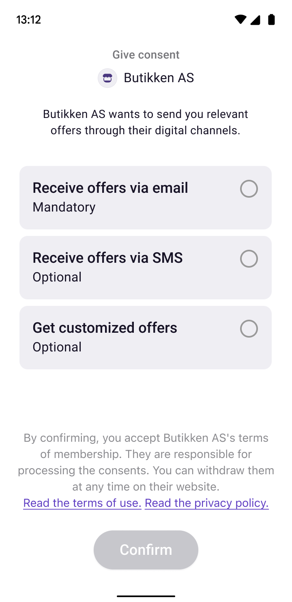
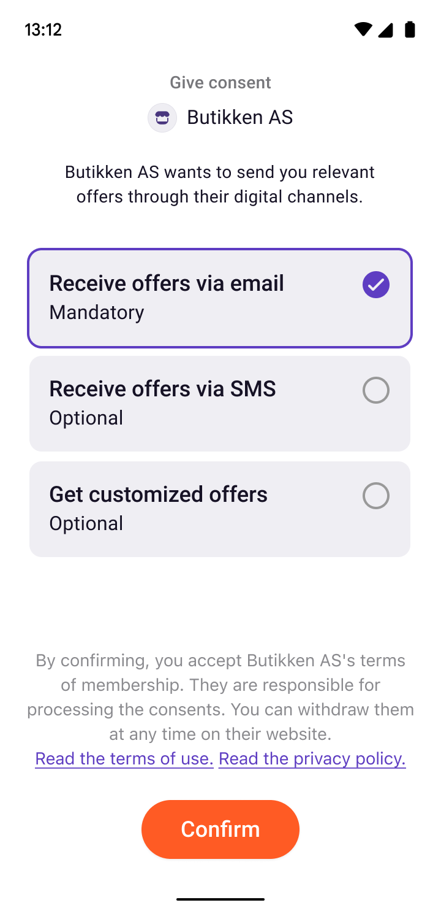

<!-- START_METADATA
---
title: How Vipps Login works from a phone number
sidebar_label: From a phone number
sidebar_position: 14
description: How Vipps Login works from phone number
pagination_next: null
pagination_prev: null
---
END_METADATA -->

# How Vipps Login works from phone number

Let your customers share their information or confirm who they are by triggering a Login flow on their device based on their phone number.

For technical documentation go to
[Login API - login from phone number](../api-guide/flows/phone-number-ciba-flows.md).

We also have [How Login works in the browser](vipps-login-api-howitworks.md)

This solution features in our [In-store using merchant scan](https://developer.vippsmobilepay.com/docs/solutions/loyalty-in-pos).

## The login from phone number process

The merchant has several options available to make the flow tailored to the specific use case:

* Binding message: Include a binding message in the confirmation step for some extra assurance
* Delegated consents: In this extra step, merchants can collect the consents required to enroll the customer to your loyalty program
* Redirect: You may choose to redirect the user to a website of your choosing after login is completed

The different steps are described and illustrated with screenshots below.

### 1. Initiate Vipps Login from phone number

The merchant initiates Vipps Login on the user's device from their system, based on the user's phone number.
The user receives a push notification and clicks to open the Vipps or MobilePay app.

If the user has turned off push notifications or for some other reason do not get the push, they can open Vipps or MobilePay themselves and automatically start the login flow.

### 2. Confirmation

After opening their Vipps or MobilePay app, the user will be asked to confirm sharing information with the merchant. The first screen will specify the information requested by the merchant.

On this screen, the merchant can choose to show a binding message (confirmation code). This is for added security if the merchant would like their representatives or their customers to have an explicit check that it is the correct transaction that is being accepted.

After confirming the login and sharing of information, the user will be asked for the formal consent to share information from Vipps MobilePay to the merchant.
The end user must only consent once per merchant and the consent applies across all Vipps MobilePay services. In other words, if the user has already consented to share the
requested information with the merchant, no consent will be required, and this step will be skipped.

### 3. Delegated consents (optional)

The merchant may choose to include the `delegatedConsents` scope to collect consents from the end user in their Vipps or MobilePay app, on behalf of the merchant.
This scope is relevant for merchants who use Vipps Login to enroll end-users into customer club/loyalty program from POS system when the user is present in-store.
If the scope is included in the request, the end user will be asked to give consents according to merchant specifications.

|                       Initial delegated consents screen                       |                           Delegated consents approved                            |
|:-----------------------------------------------------------------------------:|:--------------------------------------------------------------------------------:|
|  |  |

Some elements on the delegated consents screen can be adjusted to fit the merchant's needs:

* A top text where the purpose of collecting consents should be stated. This is customizable for you as a merchant.
* The consents wanted by the merchant (see more
  [When using delegatedConsents, which consents are supported?](../vipps-login-api-faq.md#when-using-delegatedconsents-which-consents-are-supported)).
  These can be individually specified to be mandatory or optional. Mandatory consents must be ticked before the user can complete the login flow.
  See what consents we currently support, or reach out if you need something else, and we'll see what we can do!
* A bottom text where we provide some contextual information for the end user.
The text is fixed, but the links will point to the merchant's terms and conditions, as well as privacy statement.

### 4. Redirect or end the login in the app

The merchant controls what happens after the user has confirmed the login and sharing of information.

The merchant can end the login process in the Vipps or MobilePay app, where the user will receive a confirmation screen that the login is complete.

Alternatively, the merchant may redirect the user to its website. The merchant will then have an identified user. This flow can be used to welcome a user to the customer club, ask for more information/preferences, show offers or information of relevance.

Illustration of how the flow will look when the user ends the flow and gets the confirmation of completion in the Vipps or MobilePay app:

Illustration of how the flow will look if the user is taken to the merchant's web page:

The merchant has the option to show a confirmation code (`binding_message`) to the user in the app for added security:

Great! Now you know how _Login from phone number_ works!

To check if your point of sales system or loyalty platform supports Vipps Login from phone number, please visit our [product homepage](https://vipps.no/produkter-og-tjenester/bedrift/logg-inn-med-vipps/logg-inn-med-vipps/). Check with your partner for pricing details.

Alternatively, if you want to set up the integration yourself, take a look at the technical documentation in the
[Login API - login from phone number](../api-guide/flows/phone-number-ciba-flows.md).
