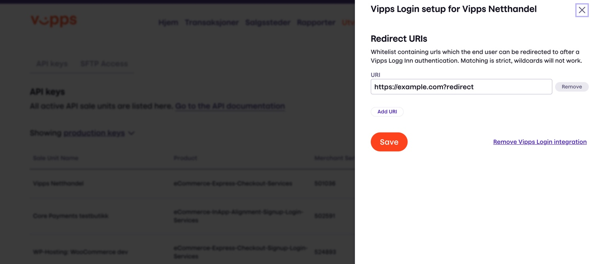
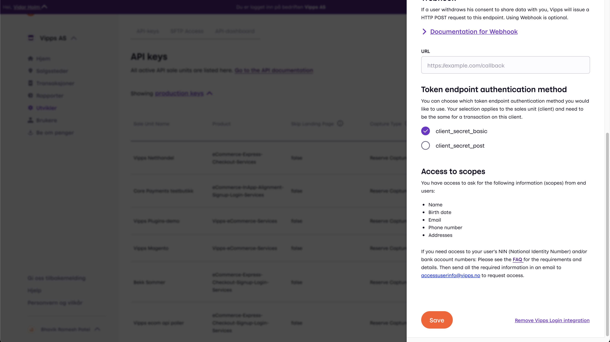
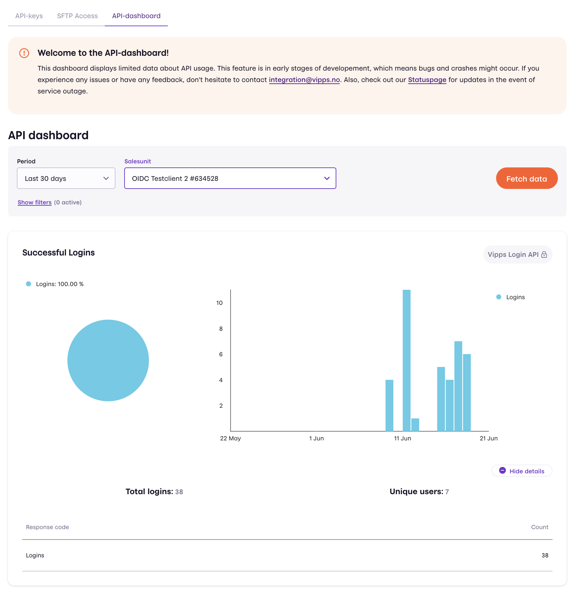

<!-- START_METADATA
---
title: FAQ
sidebar_position: 50
---
END_METADATA -->

# Vipps Login API: Frequently Asked Questions

<!-- START_COMMENT -->

ℹ️ Please use the new documentation:
[Vipps Technical Documentation](https://vippsas.github.io/vipps-developer-docs/).

<!-- END_COMMENT -->

Here are the Login API FAQs.
See the [Vipps Login API](vipps-login-api.md) for all the details.

For more common Vipps questions, see:

* [Vipps API General FAQ](https://vippsas.github.io/vipps-developer-docs/docs/vipps-developers/faqs/)

You can also find frequently asked questions in the
[Product FAQ](https://vipps.no/hjelp/vipps/vipps-logg-inn).

Document version 2.3.8.

<!-- START_TOC -->

## Table of contents

* [Where do I find the `client_id` and `client_secret`?](#where-do-i-find-the-client_id-and-client_secret)
* [How can I activate and set up Vipps Login?](#how-can-i-activate-and-set-up-vipps-login)
* [What are the requirements for Redirect URIs?](#what-are-the-requirements-for-redirect-uris)
* [How can I change my name and logo?](#how-can-i-change-my-name-and-logo)
* [How can I use `client_secret_post` for authentication?](#how-can-i-use-client_secret_post-for-authentication)
* [Why do I get `Error: invalid_client`?](#why-do-i-get-error-invalid_client)
* [Why do I get `Error: Could not get Vipps Login token” in Vipps`?](#why-do-i-get-error-could-not-get-vipps-login-token-in-vipps)
* [Which scopes can I use? Why do I get `Invalid_scope`?](#which-scopes-can-i-use-why-do-i-get-invalid_scope)
* [If a user changes phone numbers, is the `sub` still the same?](#if-a-user-changes-phone-numbers-is-the-sub-still-the-same)
* [Why can I get userinfo after the user has revoked consent?](#why-can-i-get-userinfo-after-the-user-has-revoked-consent)
* [Can a Vipps user less than 15 years old use Vipps Login?](#can-a-vipps-user-less-than-15-years-old-use-vipps-login)
* [Who can get access to NIN and how?](#who-can-get-access-to-nin-and-how)
* [Who can get access to Vipps Login from phone number and how?](#who-can-get-access-to-vipps-login-from-phone-number-and-how)
* [How can I get started with delegatedConsents?](#how-can-i-get-started-with-delegatedconsents)
* [When using delegatedConsents, which consents does Vipps support?](#when-using-delegatedconsents-which-consents-does-vipps-support)
* [What's the purpose of the `state` parameter?](#whats-the-purpose-of-the-state-parameter)
* [Can I use partner keys for Vipps login?](#can-i-use-partner-keys-for-vipps-login)
* [Can I control if a user is remembered in the browser (set up as 2FA)?](#can-i-control-if-a-user-is-remembered-in-the-browser-set-up-as-2fa)
* [Can I see statistics on Vipps Login usage?](#can-i-see-statistics-on-vipps-login-usage)
* [How is GDPR handled with Vipps Login?](#how-is-gdpr-handled-with-vipps-login)
* [Can we control the language displayed to the user?](#can-we-control-the-language-displayed-to-the-user)
* [Which configuration should I have when integrating using Azure B2C?](#which-configuration-should-i-have-when-integrating-using-azure-b2c)
* [How can we detect users' consent removal?](#how-can-we-detect-users-consent-removal)
* [Can we have multiple URIs as landing pages?](#can-we-have-multiple-uris-as-landing-pages)
* [Can I use a custom URL scheme for the `redirect_url`?](#can-i-use-a-custom-url-scheme-for-the-redirect_url)
* [Can we change the name that appears in customer's Vipps app under `Login and Access`?](#can-we-change-the-name-that-appears-in-customers-vipps-app-under-login-and-access)
* [How can I log out a user?](#how-can-i-log-out-a-user)
* [Common errors](#common-errors)
  * [Why do I get `The client or its related sale unit or merchant does not exist or is not active`?](#why-do-i-get-the-client-or-its-related-sale-unit-or-merchant-does-not-exist-or-is-not-active)
  * [Why do I get a CORS error?](#why-do-i-get-a-cors-error)
  * [Why do I get `No CSRF value available in the session cookie`?](#why-do-i-get-no-csrf-value-available-in-the-session-cookie)
  * [Why do I get `HTTP 502 Bad Gateway`?](#why-do-i-get-http-502-bad-gateway)
* [Questions?](#questions)

<!-- END_TOC -->

## Where do I find the `client_id` and `client_secret`?

See:
[Common topics: API Keys](https://vippsas.github.io/vipps-developer-docs/docs/vipps-developers/common-topics/api-keys#getting-the-api-keys).

Be aware that you _only_ use the `client_id` and `client_secret`, not the
subscription key (`Ocp-Apim-Subscription-Key`).

## How can I activate and set up Vipps Login?

On [portal.vipps.no](https://portal.vipps.no), in the same place as the
`client_id` and `client_secret` described above, you can activate Vipps Login,
and also add the redirect URIs needed for the service to work. This is the URL/URI of
the page which the user is redirected to after finishing a login. See:
[API endpoints](vipps-login-api.md#api-endpoints)
as well as requirements for the URIs below.

You will find the "Setup Vipps Login" option in the same place as you find your
`client_id` and `client_secret` (click "setup login" to get started):

First you activate Vipps Login:

Then you can add the redirect URIs you need:

## What are the requirements for Redirect URIs?

We validate redirect URIs against a whitelist of pre-approved URIs. The URIs
must be registered by the merchant on [portal.vipps.no](https://portal.vipps.no).

You can register as many as you want to. You specify the URI that will be used with
the query parameter `redirect_uri` on the initial request to the authentication
endpoint.

**Please note:**

* The redirect URI cannot contain `#`.
* You can use `localhost` as part of the redirect URI.
* You can use “Custom URL Scheme” in the redirect URIs to redirect back an app.
  In this case a path is required: `myapp://path-to-something`
  (not just `myapp://`).

## How can I change my name and logo?

Vipps Login will show the name of the sales unit you use in the different
Vipps Login user dialogues. This includes the confirm login screen, the give
consent screen and the overview of consents given.

You can administer this name for `production` in
[portal.vipps.no](https://portal.vipps.no).

To change your display name in production you go to sales units ("salgssteder") in the
left menu and select the correct unit. From this page you can see the key
information for this sales unit:

.

You go to the sales unit ("salgssted") and click the correct unit. From this
page you can see the key information for this sales unit

By clicking "Rediger" next to the "Visning i appen" heading you will come to a
screen where you both can update your name and ad your logo:

Currently, this logo is not use for Vipps Login but soon it will be shown in the
overview of consents given.

Unfortunately you cannot change the name used for the test environment.

## How can I use `client_secret_post` for authentication?

It is possible to change the token endpoint authentication method on
[portal.vipps.no](https://portal.vipps.no).
This setting will then apply to all login transactions on this sales unit.

Under the "Utvikler" section you will find the Setup Vipps Login option for
your sale units.

Here you have the option to change the token endpoint authentication method,
and see which method is currently active:

## Why do I get `Error: invalid_client`?

This means that the `client_id` and `client_secret` used is not valid for Vipps Login.

Please check:

* Have you activated Vipps Login and set up a redirect URI? See:
  [How can I activate and set up Vipps Login?](#how-can-i-activate-and-set-up-vipps-login)
* Have you double checked that the `redirect_uri` used in the API call is
  _exactly_ the same as the one specified on [portal.vipps.no](https://portal.vipps.no)?
  Be extra careful with trailing `/` and URL-encoded entities.
* Are you using the `client_id` and `client_secret` for the correct environment?
  There are separate API keys for test and production. See:
  [Common topics: API Keys](https://vippsas.github.io/vipps-developer-docs/docs/vipps-developers/common-topics/api-keys).

## Why do I get `Error: Could not get Vipps Login token” in Vipps`?

You can get this error if you have both the Vipps test app and production app
on the same phone.

## Which scopes can I use? Why do I get `Invalid_scope`?

If you get “Invalid_scope” this means that you have included one or more scopes
that you do not have access to or that is not supported. You will find the
[list of supported scopes](vipps-login-api.md#scopes).

All merchants get access to these scopes:

* openid
* address
* birthdate
* email
* name
* phoneNumber

**Important:** You should not ask for more scopes than you need for your
application. The user will need to consent to sharing the information with you
so adding more scopes increases the chance that they will decline.

The scopes “openid” is required and does not require end user consent. It
provides the claim “sub” which is a unique id for the end user at that
particular merchant. Note: Different merchants will get different subs for the same end user.

Some merchants can get access to NIN. Merchants need to request this separately.

You can find the list of scopes that your individual sales units have access to in
[portal.vipps.no](https://portal.vipps.no)
under the "Utvikler" section and the "Setup Vipps Login" panel.

## If a user changes phone numbers, is the `sub` still the same?

Yes, it's connected to the national identity number (NIN).

## Why can I get userinfo after the user has revoked consent?

During a login or a payment session the user consent to share information if
it's requested by the merchant. The users information is then available for
the merchant from the user info endpoint. For login sessions user information
is available for the ongoing login session.

To better support merchants that
do not handle online fetching and processing of the user info as part of a
payment session we keep this information accessible for the merchant for the
next 168 hours, even though the user revokes the consent in this period.
Revoking consents will immediately affect future login and payment sessions.

## Can a Vipps user less than 15 years old use Vipps Login?

Nope. Legal requirements require that users must be 18 years old.

## Who can get access to NIN and how?

Access to NIN is a paid service.

Only merchants with legal requirements or other objective needs to use Norwegian
National Identity Number (NIN) to achieve required user identification can get
access to NIN.  We correspond to
[the guidance from Datatilsynet](https://www.datatilsynet.no/rettigheter-og-plikter/personopplysninger/fodselsnummer/)
on this.

According to this NIN can only be used when it is legally required or when
there is a need for a secure identification of the person and the NIN is
required to achieve this. This applies e.g. when a company is required to
report to the tax authorities or within healthcare and credit.

Keeping a unique and consistent identifier for the user over time is not a
sufficient requirement. For this purpose Vipps offers a unique merchant specific
user identifier that are delivered as part of the registration/login. This is
the claim "sub" that is delivered based on the "openid" scope. This unique
identifier will allow you to keep a consistent user profile even if the user
changes contact information.

Beware that login with Vipps it not an electronic ID. Thus the NIN can only be
used to simplify the customers processes by removing manual input or to lookup
the customer in your own or external registers. This can be done as part of the
processes to become a customer or to link login with Vipps to an existing user.
If you need to store the NIN for new users we recommend that you use an
electronic ID.

Merchants need to apply for access to NIN separately by sending an email to
accessuserinfo@vipps.no. In the email you should specify:

* Merchant name
* Organization number
* Name and number of the sale unit from [portal.vipps.no](https://portal.vipps.no)
* Information on how you plan to use the NIN
* The legal requirement and/or the reason why you need to use NIN to achieve
  required user identification.

## Who can get access to Vipps Login from phone number and how?

Vipps Login from phone number has been developed to support use-cases where
authentication/registration does not start in a browser or an app. This means
that it is the merchant/merchant’s systems that trigger the
authentication/registration and thus login cannot be done in the user’s browser.
Vipps Login from phone number are reserved for such special cases and needs to be specially
enabled by Vipps for eligible sale units. If a merchant uses Vipps Login from phone number on
webpages or in apps used by end-users (on their own device), access to the feature can be withdrawn.

Merchants need to apply for access to Vipps Login from phone number separately. 
This is done by sending an email to [accessuserinfo@vipps.no](mailto:accessuserinfo@vipps.no) and supplying the following information:
 * Merchant serial number (MSN) for the sale unit for which you will use Vipps Login (this can be retrieved from [portal.vipps.no](https://portal.vipps.no))
 * Information on how you plan to use Vipps Login from phone number

Vipps Login from phone number is a billed service. As such, we also need some details regarding invoicing:
 * Recipient name
 * Recipient email
 * Invoicing address

## How can I get started with delegatedConsents?

If you plan on using the scope `delegatedConsents` along with Vipps Login from phone number,
you will need to supply some information on what consents you will retrieve and how.
We will then tailor this screen to suit your needs. You can see what the flow looks like at
[Vipps Login from phone number](vipps-login-from-phone-number-api-howitworks.md).
Send an email to accessuserinfo@vipps.no and supply the following information:

| Item                                                 | Description                                                                                                                                                                    | Example                                                                           | Comments                                                                                               |
|------------------------------------------------------|--------------------------------------------------------------------------------------------------------------------------------------------------------------------------------|-----------------------------------------------------------------------------------|--------------------------------------------------------------------------------------------------------|
| Top text                                             | Specifies the purpose of collecting the consents                                                                                                                               | "Merchant AS would like to send you tailored offers in several digital channels." |                                                                                                        |
| Subset of consents you would like to ask for         | We offer a set of predefined consents. See [When using delegatedConsents, which consents does Vipps support?](#when-using-delegatedconsents-which-consents-does-vipps-support) | email, sms, digital, personal                                                     | If you want a consent type that we currently don't support, reach out to us at accessuserinfo@vipps.no |
| Links to your membership terms and privacy statement | We need to check your terms to make sure the flow is not used to mislead or abuse the end user                                                                                 | www.merchant.com/termsandconditions   www.merchant.com/privacystatement      |                                                                                                        |
| Recipient to sign DPA                                | Vipps will function as a data processor and not have any ownership to the data involved. For more information, please visit merchant terms and conditions                      | recipient@merchant.com                                                            |                                                                                                        |

## When using delegatedConsents, which consents does Vipps support?

We have built support for several consents, and the merchant may select a subset of these to include in their own flow as well as select which of the consents that are required/optional.
If we do not currently support the consents you look for, you may make a request to accessuserinfo@vipps.no and we'll be in touch.

| Id       | Consent text (Norwegian)            | Consent text (English)                    |
|----------|-------------------------------------|-------------------------------------------|
| email    | Få tilbud på E-post                 | Receive offers via email                  |
| sms      | Få tilbud på SMS                    | Receive offers via SMS                    |
| digital  | Jeg vil motta digital markedsføring | I would like to receive digital marketing |
| personal | Få tilpassede tilbud                | Get customized offers                     |

For more information about the response, please visit [Merchant delegated consents api doc](vipps-login-api.md#merchants-delegated-consents).

## What's the purpose of the `state` parameter?

The `state` parameter is an opaque value used by the client to maintain state
between the request and callback. The authorization server includes this value
when redirecting the user-agent back to the client. The parameter should be
used for preventing cross-site request forgery.

## Can I use partner keys for Vipps login?

Partner keys are currently only available for the Vipps Login from phone number flows.

For other scenarios, Vipps login does not support partner keys. Each merchant has it own
individual 'client id' and 'client secret' and need to share this with the
partner if required.

We support some scenarios where a merchant can be used for registration and
login to other sites/merchants. Specific terms and conditions related to
UX/branding, consent, terms and privacy statement apply to such scenarios.
These can be found in section 8.4 in our
[Terms and Conditions for merchants](https://www.vipps.no/vilkar/vilkar-bedrift/)

## Can I control if a user is remembered in the browser (set up as 2FA)?

No. Vipps Login do not support merchants specifying that the user needs
to use the app to authenticate (two factor authentication - 2FA). The end-user chooses
whether he would like to be remembered in browser or not. This is seen as a key feature of the service.

## Can I see statistics on Vipps Login usage?

Yes, statistics on successful logins with Vipps in production is available on
[portal.vipps.no](https://portal.vipps.no). You find this information in the
"Utvikler" section. You first click "Utvikler" and then API-dashboard on the
top of the page. The statistics are only available for the production environment.
Choose the sales unit with Vipps Login that you would like to see, the time
period you would like to have covered and click "Fetch data".
Then scroll down until you find the panel named "Successful logins".

If you have access to request national identity number (NIN) you will be able to see the number of logins with and without these
scopes. If you click "Show details" under the graph you can see total logins
for the period and number of unique users in the selected period. Keep in
mind that there is a 10 minute delay from a login occurs, until it appears
on the dashboard.

## How is GDPR handled with Vipps Login?

With regard to the processing of personal data and GDPR, the following applies
to Vipps Login:

1. Vipps Login gives a merchant the opportunity to ask a Vipps end user to share
   a selection of data from their profile in Vipps. This can e.g. be name, phone
   number, email, addresses and date of birth. The merchant controls which of
   these data they request. The user must consent to the sharing of data for
   this to be done. The consent is the legal basis for Vipps AS' transfer of
   this information to the merchant.

2. Vipps AS is responsible for our processing of information related to Vipps
   end users and the personal information generated using the Vipps services.
   For the Vipps Login service, the merchant will be responsible for the
   processing of the profile information received, starting when the merchant
   receives the profile information from Vipps end user. The merchant will thus be an independent data processor for this data, and there is no need for a data processing agreement between Vipps and the merchant.

3. The merchant must therefore obtain a valid basis for further processing of
   the personal data (e.g agreement, terms or consent), to e.g. register the
   information in its customer register and start customer processing from there.

4. When such sharing from Vipps AS to the merchant has been made, a Vipps end
   user can later use Vipps to log in to the merchant, and the merchant will
   then have access to updated information on the data elements that the company
   has requested. A Vipps end user can go into Vipps (the app) and see which
   companies they have shared data with, which data has been shared and they
   can withdraw their consent to share. This means that new consent must be
   obtained before Vipps AS can share data again with the merchant.

5. When an end user uses Vipps Login at a merchant, Vipps AS stores, as part
   of our service to the Vipps end user and with Vipps AS as data processor,
   information about a) what information a user has agreed to share with a
   merchant and b) when a user has used Vipps log in to the relevant merchant.

6. Vipps AS does not receive any information from the merchant about Vipps end user.

See more information in our end user
[terms and condition](https://www.vipps.no/vilkar/vilkar-privat/),
[privacy policy](https://www.vipps.no/vilkar/cookie-og-personvern/)
and
[merchant agreement](https://www.vipps.no/vilkar/vilkar-bedrift/)

## Can we control the language displayed to the user?

No. The language is controlled by the browser.  
Specifically `window.navigator.language`, however it gets more complicated as there are fallbacks.  
Refer to documentation for your browsers.  

## Which configuration should I have when integrating using Azure B2C?

Azure B2C overrides the `redirect_uri` parameter to redirect to Azure B2C first, then to your redirect URI.
You will need to look at your call to `https://apitest.vipps.no/access-management-1.0/access/oauth2/auth`
and find the `redirect_uri` query parameter. This will need to be whitelisted in
[portal.vipps.no](https://portal.vipps.no).

See [What are the requirements for Redirect URIs?](#what-are-the-requirements-for-redirect-uris)

Azure B2C uses `client_secret_post` as `token_endpoint_auth_method` and the default value is
`client_secret_basic`, so you'll need to change this in the [portal.vipps.no](https://portal.vipps.no).

See [How can I use `client_secret_post` for authentication?](#how-can-i-use-client_secret_post-for-authentication)

Vipps login does not return user information in the `id_token`, but provides a
userinfo endpoint for this use case. See
[the user info endpoint documentation](vipps-login-api.md#userinfo).
Azure B2C's User Flows does not use the userinfo endpoint and you will therefore need
to use a [Custom policy](https://docs.microsoft.com/en-us/azure/active-directory-b2c/userinfo-endpoint?pivots=b2c-custom-policy).

## How can we detect users' consent removal?

Or: How can our system dynamically "know/find out" if the user has revoked the consent
for us to have access to his/her personal data in our system?

We have a system for notifying merchants when an end user revokes their consent.
See the
[Consent Webhooks](vipps-login-api.md#consent-webhooks) section for more information.

## Can we have multiple URIs as landing pages?

Yes. You can register as many callback URLs as you want; and then you specify which
one you use in the request to
[/auth](https://vippsas.github.io/vipps-developer-docs/api/login#tag/Vipps-Login-API/operation/oauthAuth).

## Can I use a custom URL scheme for the `redirect_url`?

If the `redirect_url` is using a custom URL scheme, such as `myapp://`, a path
is required: `myapp://path-to-something`.

## Can we change the name that appears in customer's Vipps app under `Login and Access`?

The name which is displayed in the app is the name of the sale unit.
You can do it yourself on
[portal.vipps.no](https://portal.vipps.no/).
Press `rediger`/`edit` under `salgsstedsinfo`/`?` and change to the desired name.

## How can I log out a user?

 _Vipps Login_ does not support merchant initiated logout in the browser as this would effectively log the user out of Vipps Login (meaning that the user will no longer be remembered in the browser across sites that use Vipps Login). You are of course free to log the user out of your service (by disabling your own session).

If a user wants to log out of a specific browser remembered in Vipps Login, they need to do this in the Vipps app by navigating to:  
`Profile->Personal Information->Browsers that remember you`, select a browser and press the logout button.

## Common errors

See
[FAQ: Common errors](https://vippsas.github.io/vipps-developer-docs/docs/vipps-developers/faqs/common-errors-faq)
for more questions.

### Why do I get `The client or its related sale unit or merchant does not exist or is not active`?

This means that the API credentials are for a MSN (Merchant Serial Number)
that does not exist, or is not active. This can happen if the organization number
has been deactivated at [Brønnøysundregistrene](https://www.brreg.no).

### Why do I get a CORS error?

We do not currently support any flows that requires requests being made from browsers.

### Why do I get `No CSRF value available in the session cookie`?

Certain versions of Chrome gives the error `No+CSRF+value+available+in+the+session+cookie`.
Upgrading to the latest version of Chrome should solve this.

### Why do I get `HTTP 502 Bad Gateway`?

Some merchants have experienced a 502 Bad gateway response from api.vipps.no.
This typically occurs in situations in which the `state` or `nonce` parameter
is 1000+ characters. We've seen this issue when any of the requests in the
redirect sequence are too long (i.e 2000+ characters). Therefore, try to keep
these parameters at sane lengths. If there is a need to encode some payload in
the `state` (i.e a JWT), it would be a better option to cache this at the
client server and use the key as `state`.

## Questions?

We're always happy to help with code or other questions you might have!
Please create an [issue](https://github.com/vippsas/vipps-login-api/issues),
a [pull request](https://github.com/vippsas/vipps-login-api/pulls),
or [contact us](https://vippsas.github.io/vipps-developer-docs/docs/vipps-developers/contact).

Sign up for our [Technical newsletter for developers](https://vippsas.github.io/vipps-developer-docs/docs/vipps-developers/newsletters).
