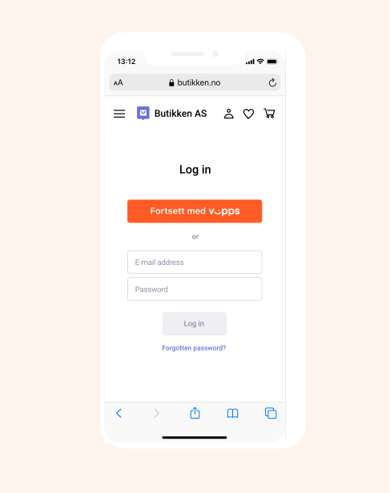
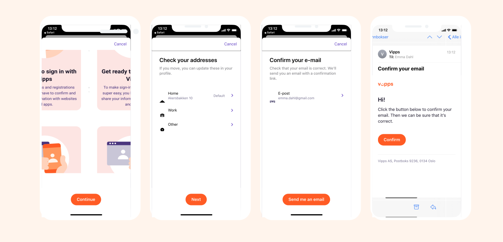
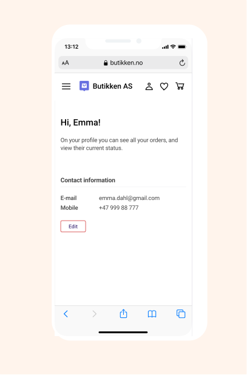

# Vipps Login API: How It Works

Let your customers log in to your website or app without the need for user names and passwords.

For technical documentation go to
[Vipps Login API](https://github.com/vippsas/vipps-login-api)

## The login process

## The first time using Vipps Login

### 1. Log in with Vipps

A user chooses to log in with Vipps on a merchant’s site.

### 2. The Vipps landing page

If the login was started on a desktop device the user will be sent to the Vipps landing page. The user enters their phone number, and can choose to be remembered in the browser for a quicker login the next time. The user is then prompted to log in to Vipps, and follow the instructions in the app.

If the login was started from a mobile device, the user will be taken directly to Vipps (without visiting the Vipps landing page).

### 3. E-mail verification (first time only)

If the merchant has requested the user’s e-mail, the user have to verify their e-mail address in Vipps on the initial login. The user can also check and change their registered addresses. This is only necessary to do once. If the merchant has not requested the user's e-mail, this step is skipped.

### 4. Confirm login

The user confirms the login on the merchant’s page.

If the login was started on a phone, the user can in this step choose to be remembered in the browser for a quicker login the next time.

If the login was started on desktop, the user confirms that the emoji in Vipps matches the one on the landing page, and confirms the login.

### 5. Give consent to share information

The user gives consent to share information with the merchant.

The user may click "See your information", but this is optional.

### 6. Logged in

The user is now logged in on the merchant’s page.

The user may be given the opportunity to edit the information, for instance
to add additional details not present in the user's Vipps profile.

## Great! Now you know how the Vipps Login process works.

Take a look at the technical documentation in the [Vipps Login API Guide](https://github.com/vippsas/vipps-login-api/blob/master/vipps-login-api.md).

## Questions?

We're always happy to help with code or other questions you might have!
Please create an [issue](https://github.com/vippsas/vipps-login-api/issues),
a [pull request](https://github.com/vippsas/vipps-login-api/pulls),
or [contact us](https://github.com/vippsas/vipps-developers/blob/master/contact.md).
