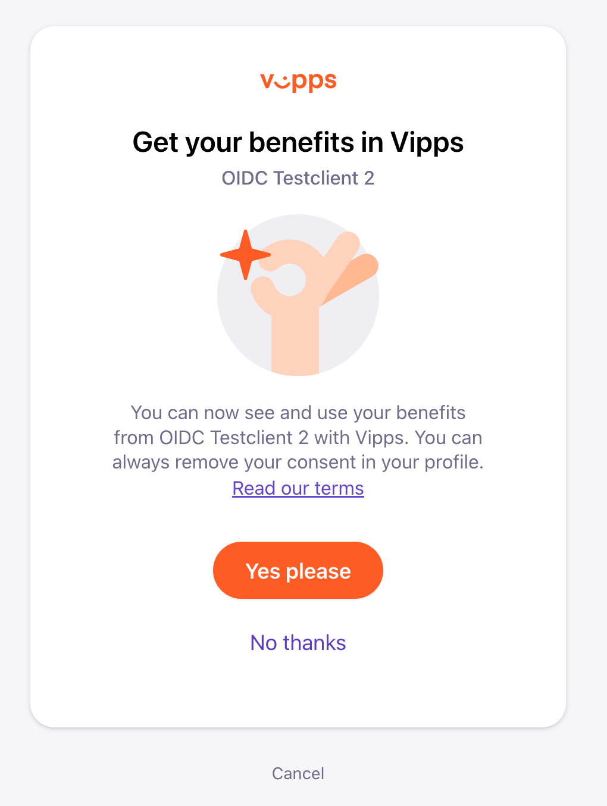

### Benefits in Vipps through Vipps Login

Note: *This is currently work in progress and not part of the official documentation for Vipps Login*

Vipps Login offers the merchant to publish benefits to the end user in the Vipps App. A benefit could be a discount coupon that the End User will see in the Vipps app after signing up to your customer club through Vipps Login

## Consent to receiving benefits
In order for Vipps to be able to expose benefits from a merchant, we need to gather the explicit consent from the user. This consent is obtained in the Vipps Login in Browser flow. The user will be presented with the consent to benfits scrreen if the OIDC scope `promotions` is requested as part of the initial `/auth`request. When the `promotions`scope is requested the user will be presented with this screen as part of the login flow: 



The user can choose to opt in/out to receiving benefits from the merchant in Vipps, either way the login is completed and the merchant will be able to see the user's choice when requestiing `/userinfo`

Note: Access to the `promotions` scope is configured on a per-merchant level. If you want to experiment with benefits in Vipps, please send an email to accessuserinfo@vipps.no and we will get in touch. 

## Enabling benefits
WiP - more will come later

## Redeeming benefits
When the user redeems a coupon, either through an online code in the checkout or in a physical store, the merchant should make a request to our `/redeem` endpoint to notify Vipps that the coupon has been redeemed. The motivation for posting to the redeem endpoint is to remove the coupon from the end-user's home screen in Vipps. 

### Authenticate to the redeem endpoint
Merchants can request an access token valid for the redeem endpoint by making a request to [POST:/accesstoken/get](https://vippsas.github.io/vipps-ecom-api/#/Authorization_Service/fetchAuthorizationTokenUsingPost). This is documented in more detail in the general [Vipps developer documentation](https://github.com/vippsas/vipps-developers/blob/master/vipps-getting-started.md#quick-overview-of-how-to-make-an-api-call) 

### The redeem endpoint
The redeem endpoint is available at `POST:/vipps-user-benefits-api/coupons/redeem`. 

It  expects an `Authorization` header with the access token. The payload is not settled quite yet but will for certain include the fields `psub` of the user and the `campaign_id` as required fields. We also consider adding an optional text field where the merchant can submit the location for the redeemed coupon (i.e. store name, online)  

A preliminary example of the payload:

```json
{
  "psub": "<guid>",
  "campaign_id": "<numeric>",
  "source": "<text>"
}
```
