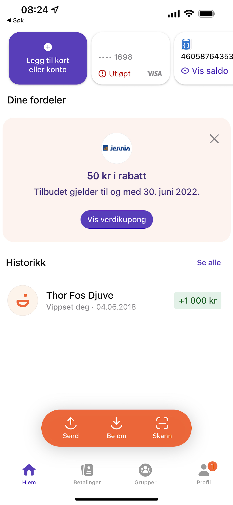
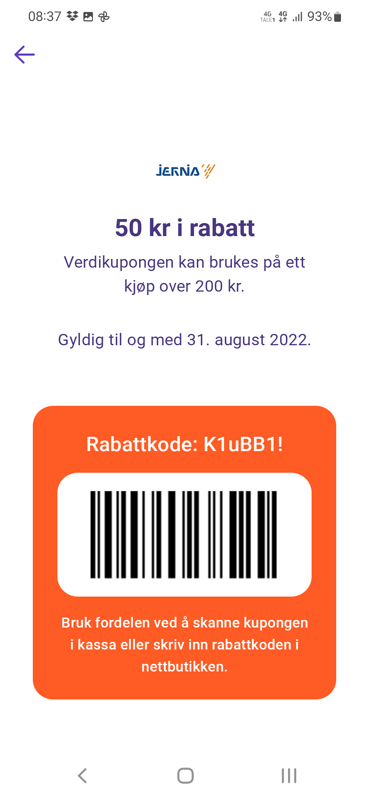

# Benefits in Vipps through Vipps Login

Note: *This is currently work in progress and not part of the official documentation for Vipps Login*

Vipps Login lets the merchant publish benefits to the end user in the Vipps app. A benefit could be a discount coupon that the end user will see in the Vipps app after signing up to your customer club or loyalty scheme by using Vipps Login

## Consent to receiving benefits
In order for Vipps to be able to expose benefits from a merchant, we first need to gather an explicit consent from the end user. This consent is obtained in the Vipps Login in Browser flow. Additions to support this consent in our other flows (Vipps Login from phone number and Vipps Login from QR) will come later. 

The user will be presented with the consent to benfits page if the OIDC scope `promotions` is requested as part of the initial `/auth` request. When the `promotions` scope is requested the user will be presented with this screen as part of the login flow: 


The user can opt in/out to receiving benefits from the merchant, either way the login is completed and the merchant will be able to see the user's choice in the subsequent request `/userinfo` in the field `promotions`:

```json
  "promotions": {
    "accepted" : true
  }
```

**Note:** Access to the `promotions` scope is configured on a per sales unit level. If you want to experiment with benefits in Vipps, please send an email to [accessuserinfo@vipps.no](mailto:accessuserinfo@vipps.no) and we will get in touch to set it up for you. 

## Enabling benefits
WIP - more will come later, suffice to say that this is currently a quite manual process where we define the benefit together with the merchant. 

## Displaying benefits
Benefits are currently displayed on the home screen. The end user can tap to open the benefit and see the options for redeeming from the home screen by tapping it. In this example the benefit can be redeemed by scanning the bar code in a physical store or by entering the redeem code in an online checkout

Home screen                |  Details
:-------------------------:|:-------------------------:
| 

The barcode in the coupon is encoded as Code-128 and represents the 8 digit phone number of the end-user without country code. The merchant's POS system should be able to scan this barcode and admit the benefit/discount as part of the checkout

The online code is used for online checkout. The merchant's online checkout should be able to recognize this code and admit the discount. 

## Redeeming benefits
When the end user redeems a benefit, either through an online code in a physical store, the merchant should make a request to our `/redeem` endpoint to notify Vipps that the coupon has been redeemed. The motivation for posting to the redeem endpoint is to remove the coupon from the end user's Vipps app.

Merchants can request an access token valid for the redeem endpoint by making a request to [POST:/accesstoken/get](https://vippsas.github.io/vipps-ecom-api/#/Authorization_Service/fetchAuthorizationTokenUsingPost). This is documented in more detail in the general [Vipps developer documentation](https://github.com/vippsas/vipps-developers/blob/master/vipps-getting-started.md#quick-overview-of-how-to-make-an-api-call)

The redeem endpoint is available at 

`POST:/vipps-user-benefits-api/coupons/redeem`. 

It expects an `Authorization` header with the access token. The payload is not settled quite yet but will for certain include the fields `psub` of the user and the `campaign_id` as required fields. We also consider adding an optional text field where the merchant can submit the location for the redeemed coupon (i.e. store name, online)  

A preliminary example of the payload:

```json
{
  "psub": "<guid>",
  "campaign_id": "<numeric>",
  "source": "<text>"
}
```
