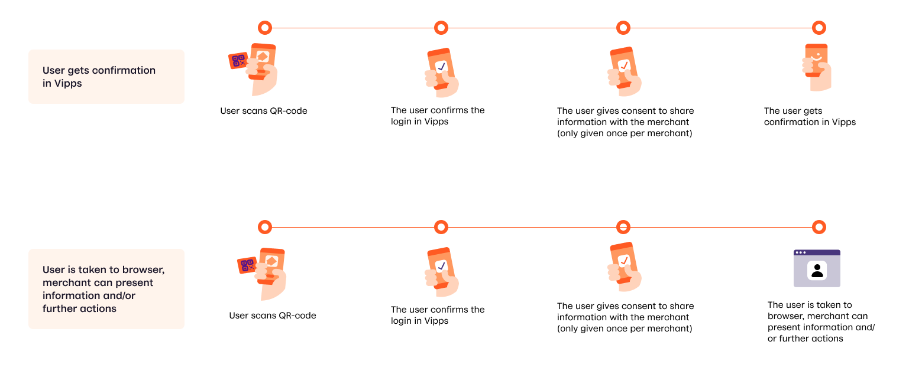
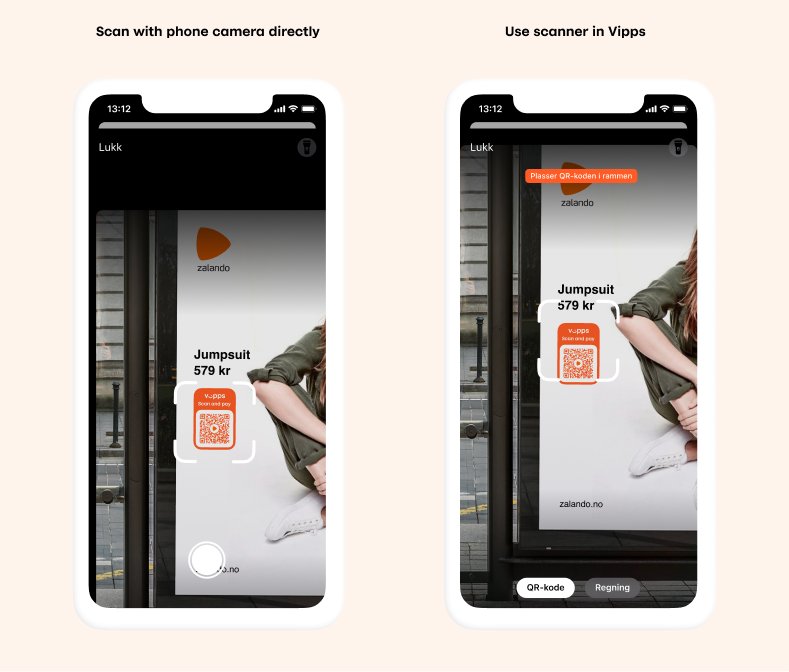
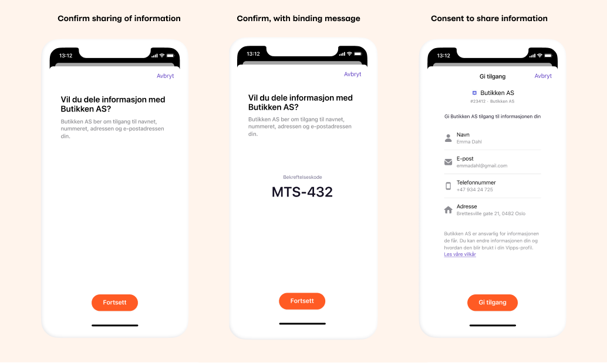
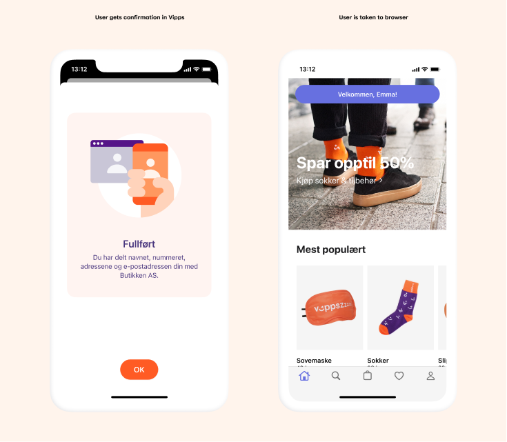

# Vipps Login from QR-code API: How It Works

Let your customers register or login based on scanning a QR-code.

For technical documentation go to
[Vipps Login API](https://github.com/vippsas/vipps-login-api/blob/master/vipps-login-api.md)

## The login from QR-code process
You can choose between two different processes/user experiences 

The different steps are described and illustrated with screenshots below.

### 1. User scans QR-code
The user starts Vipps Login by scanning a Vipps QR-code set up to allow the user to perform a registration or login.

The QR-code can either be scanned by the camera on the phone directly - in this case the user will be taken to Vipps after scanning the QR-code, or the user can open Vipps and use the scanner available from there.

### 2. Confirm in Vipps
After scanning the QR-code the user will be asked to confirm sharing information with the merchant. The page will specify the information requested by the merchant.

The merchant can choose to show a confirmation code / binding message on the confirmation screen. This is for added security if the merchant would like their representatives or their customers to have an explicit check that it is the correct transaction that is being accepted. 

After confirming the login / sharing of information the user will be asked for the formal consent to share information from Vipps to the merchant. This consent is only needed once per merchant and applies across all Vipps services, i.e. if the user has already consented to share the requested information with the merchant no consent will be required.

### 3. Confirmation, possibility to continue process
The merchant controls what happens after the user has  confirmed the login/sharing of information. The merchant can end the process in Vipps giving confirmation of successfull completion in Vipps, or the merchant can have the user taken to a page in the browser on the phone. If the user is taken to a page in the browser the merchant has an identified user, can control the information given and ask the user to do further actions to continue the process if relevant. This can e.g. be used to welcome a user to the customer club and ask for more information or consent to marketing. This can also be used to present terms of condition for a subscription/purchase and allow the user to pay with Vipps.

## Great! Now you know how Vipps Login from QR-code works!

Take a look at the technical documentation in the [Vipps Login API Guide](https://github.com/vippsas/vipps-login-api/blob/master/vipps-login-api.md).

## Questions?

We're always happy to help with code or other questions you might have!
Please create an [issue](https://github.com/vippsas/vipps-login-api/issues),
a [pull request](https://github.com/vippsas/vipps-login-api/pulls),
or [contact us](https://github.com/vippsas/vipps-developers/blob/master/contact.md).
