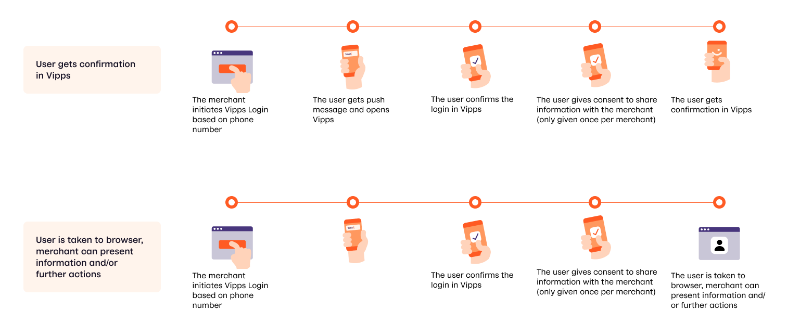
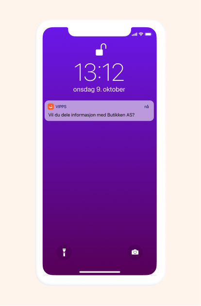

<!-- START_METADATA
---
title: How it works from mobile
sidebar_position: 14
---
END_METADATA -->

# Vipps Login from phone number: How It Works

Let your customers share their information or confirm who they are based on their phone number.

For technical documentation go to
[Vipps Login API - login from phone number](vipps-login-api.md#vipps-login-from-phone-number).

We also have _How it works_ for [Vipps Login in browser](vipps-login-api-howitworks.md) and [Vipps Login from QR-code](vipps-login-from-QR-api-howitworks.md).

## The login from phone number process

You can choose between two different processes/user experiences

The different steps are described and illustrated with screenshots below.

### 1. Initiate Vipps Login from phone number

The merchant initiates Vipps Login based on phone number from the merchant's system. The user receives a push from Vipps on the phone and clicks the push to open Vipps.

If the user has turned off push or for some other reason do not get push, they can open Vipps themselves and the process to confirm the login will start automatically.

### 2. Confirm in Vipps

After opening Vipps, the user will be asked to confirm sharing information with the merchant. The page will specify the information requested by the merchant.

The merchant can choose to show a confirmation code / binding message on the confirmation screen. This is for added security if the merchant would like their representatives or their customers to have an explicit check that it is the correct transaction that is being accepted.

After confirming the login and sharing of information, the user will be asked for the formal consent to share information from Vipps to the merchant. This consent is only needed once per merchant and applies across all Vipps services. In other words, if the user has already consented to share the requested information with the merchant, no consent will be required.

### 3. Confirmation, possibility to continue process

The merchant controls what happens after the user has  confirmed the login and sharing of information. The merchant can end the process in Vipps by giving confirmation of successful completion in Vipps, or they can have the user taken to a page in the browser on the phone.

If the user is taken to a page in the browser, the merchant has an identified user, can control the information given, and can ask the user to do further actions to continue the process, if relevant. For example, this can be used to welcome a user to the customer club, ask for more information, ask for consent to marketing, present terms of conditions for a subscription/purchase, request consent allowing the user to pay with Vipps.

## Great! Now you know how Vipps Login from phone number works!

Take a look at the technical documentation in the [Vipps Login API - login from phone number](vipps-login-api.md#vipps-login-from-phone-number).

## Questions?

We're always happy to help with code or other questions you might have!
Please create an [issue](https://github.com/vippsas/vipps-login-api/issues),
a [pull request](https://github.com/vippsas/vipps-login-api/pulls),
or [contact us](https://github.com/vippsas/vipps-developers/blob/master/contact.md).
