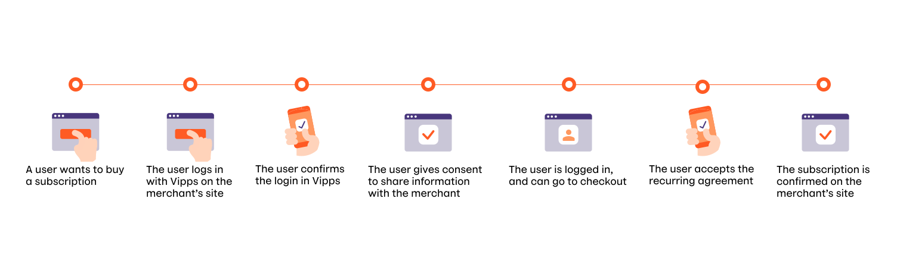
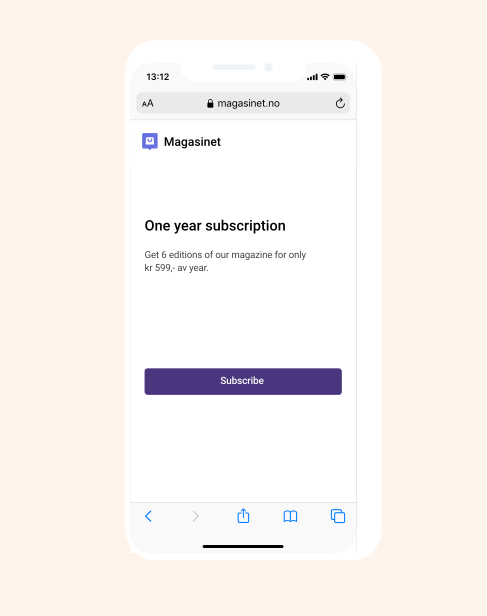
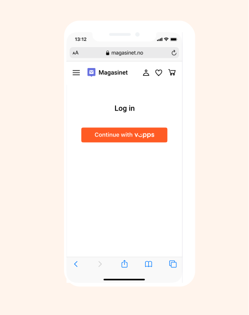
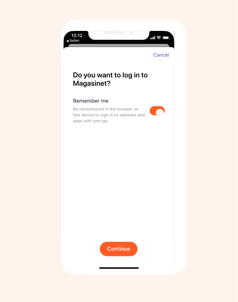
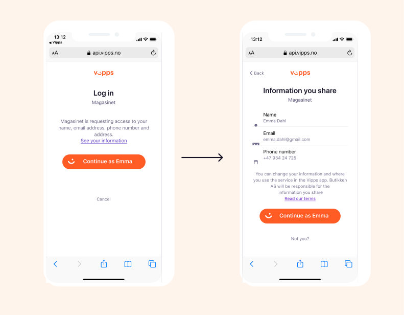
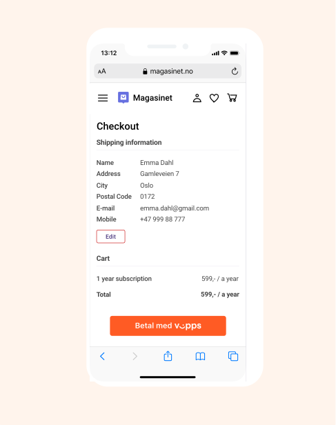
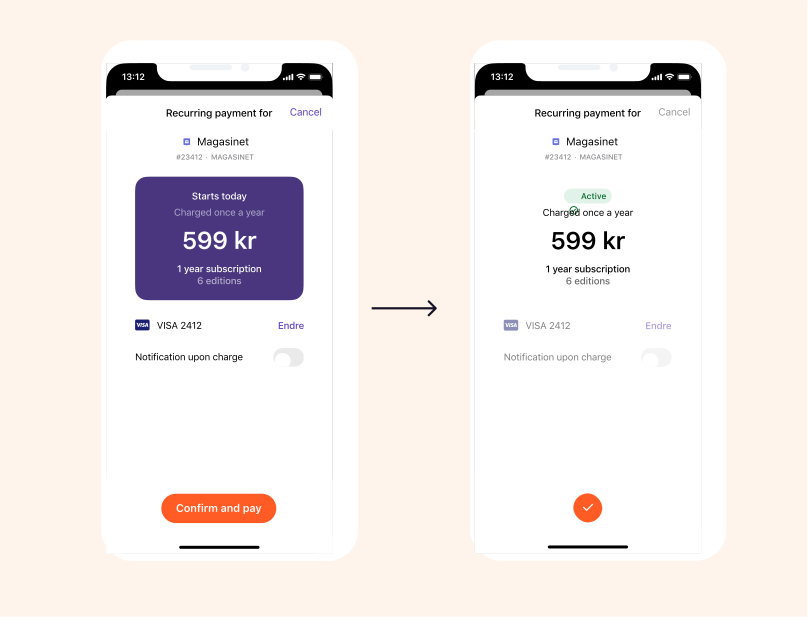
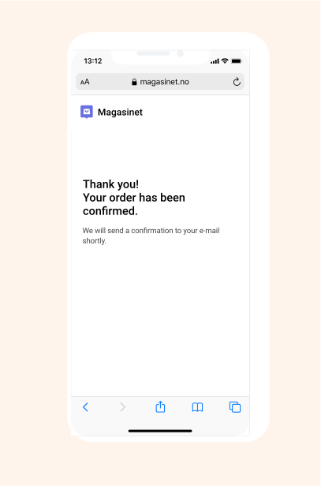

# Vipps Login + Vipps Recurring: How It Works

Vipps Login and Vipps Recurring can be used together making registration and payment simple for your customers. 

For the complete API documentation go to
* [Vipps Login API](https://github.com/vippsas/vipps-login-api)
* [Vipps Recurring API](https://github.com/vippsas/vipps-recurring-api)

## The process

## 1. Buy a subscription

A user wants to buy a subscription on a merchant’s website or app.

## 2. Login with Vipps

The user logs in with Vipps on the merchant’s site.

## 3. Confirm login

The user confirms the login in Vipps. 

## 4. Give consent to share information

The user gives consent to share information with the merchant.
The user may click "See your information" to see the actual information that will be shared, but this is optional.

## 5. Logged in and ready to checkout

The user is now logged in on the merchant’s page, and can checkout the subscription. The information the user has shared with the merchant is automatically filled in, but the user can also edit the information if necessary.

## 6. Accept agreement in Vipps

The user accept the agreement in Vipps. 

## 7. Subscription confirmed

The user is sent back to the merchant’s web site or app, and the subscription is confirmed on the merchant’s site.

## Great! Now you know how you can use Vipps Login and Vipps Recurring together.

Take a look at the technical documentation in the [Vipps Login API Guide](https://github.com/vippsas/vipps-login-api/blob/master/vipps-login-api.md), and the [Vipps Recurring API Guide](https://github.com/vippsas/vipps-recurring-api/blob/master/vipps-recurring-api.md)

## Questions?

We're always happy to help with code or other questions you might have!
Please create an [issue](https://github.com/vippsas/vipps-login-api/issues),
a [pull request](https://github.com/vippsas/vipps-login-api/pulls),
or [contact us](https://github.com/vippsas/vipps-developers/blob/master/contact.md).
